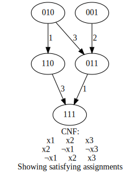
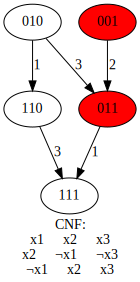

# SAT

This repo defines some functions to manipulate and visualize boolean formulas used to aid research.

Objects related to boolean formula are defined as follows
```
Literal = Union[int, bool]
Clause = List[Literal]
TotalAssignment = List[bool]
PartialAssignment = List[Optional[bool]]
```

For example the variable x1 would be represented as the integer 1, and ~x2 would be represented as -2. Conjunctive and disjunctive normal form formula are also implemented in `src/normal_form.py`.

## Examples

Define a CNF formula:
```
>>> from src.normal_form import CNF
>>> phi = CNF([[1, 2, 3], [2, -1, -3], [-1, 2, 3]])
>>> print(phi)
CNF:
x1 ∨ x2 ∨ x3
x2 ∨ ¬x1 ∨ ¬x3
¬x1 ∨ x2 ∨ x3
```

Assign variables:
```
>>> print(phi.assign_and_simplify([None, False, None]))

CNF:
x1 ∨ x3
¬x1 ∨ ¬x3
¬x1 ∨ x3
```

Evaluate a formula on an assignment:
```
>>> print(phi.evaluate_on_assignment([True, False, True]))
False
```
View solutions and falsifying assignments of a formula:
```
>>> from src.sat_algs import all_solutions, all_falsifying
>>> print(all_solutions(phi))
[[True, True, True], [True, True, False], [False, True, True], [False, True, False], [False, False, True]]
>>> print(all_falsifying(phi))
[[True, False, True], [True, False, False], [False, False, False]]
```

Visualize solutions of a CNF:
```
>>> from src.drawa
draw_solutions(phi, fname='test.svg')
```
In `test.svg` we then have:



Draw a formula with it's prime implicants of a certain size:
```
>>> prime_implicants = get_prime_implicants(phi, 1)
>>> print(prime_implicants)
>>> draw_assignments_with_mspas(all_solutions(phi), prime_implicants, phi, fname='implicant_test.svg')
```

In `implicant_test.svg` we then get:




## Requirements

Your system will need to have graphviz installed. The python requirements are listed in `sat.txt` you can install them using 
```
pip install -r sat.txt
```
